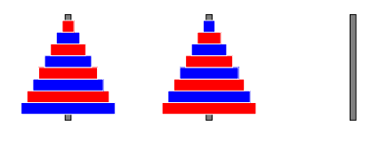
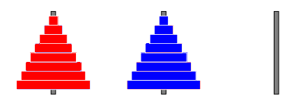

# Szoftverfejlesztés beadandó házi feladat projekt

Ez a projekt a Debreceni Egyetem szoftverfejlesztés tárgyához készült.

## Feladat leírása

`2.39 feladat: `

Adott 8 különböző méretű, piros és kék színű középen lyukas korong, amelyeket a 41. ábrán látható módon rendezünk el három rúdon. Bármelyik rúdról
át lehet helyezni a legfelső korongot egy olyan rúdra, amelyen a legfelső korong nagyobb vagy megegyező méretű az áthelyezettel. Érjük el, hogy a piros 
korongok az első, a kék korongok pedig a második rúdra kerüljenek!

  

## Készítette:

- [Kovács Attila Ákos](https://github.com/kvcsttl)

